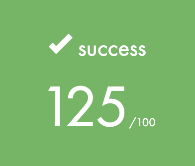
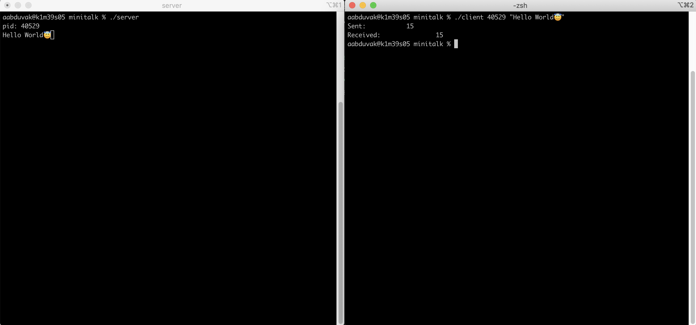

<h1 align="center">
	🧰 42 Project: Minitalk
</h1>

<p align="center">
	<b><i>The purpose of this project is to code a small data exchange program using UNIX signals.</i></b><br>
</p>

<p align="center">
	
	
	
	
	
</p>

<h3 align="center">
	<a href="#-about-the-project">About</a>
	<span> · </span>
	<a href="#%EF%B8%8F-usage">Usage</a>
	<span> · </span>
  <a href="#usefull-make-command">Usefull Command</a>
	<span> · </span>
	<a href="#-references">References</a>
</h3>

---

## 💡 About the project

> _The purpose of this project is to code a small data exchange program using UNIX signals. It is an introductory project for the bigger UNIX projects that will appear later on in the cursus. Hopefully you will be able to reuse it in future project without the fear of being flagged as a cheater. You will mainly learn how to use signal functions._

### What is minitalk?
minitalk is an individual project at [42](https://www.42istanbul.com.tr/) that requires us to create a small dataa exchange program from client to server.

### Application flow
Click [here](https://excalidraw.com/#json=X5IF2CEVuO8EhAyX9bwMZ,42SQg0D6nJcF7hwcDG1dVw) for the interactive link.

#### Objectives
- Unix logic

#### Skills
- Rigor
- Unix
- Algorithms & AI

#### My grade


## 🛠️ Usage

**Follow the steps below**

### Instructions

**1. Clone the repository from github**

```bash
git clone https://github.com/abdulazizabduvakhobov/Minitalk && cd minitalk/
```
**2. Compile the library by Makefile**
To compile the library, go to its path and run:

For all mandatory and bonus functions:

```bash
 make
```

**3. Open new terminal on the same directory and run the server:**
```bash
./server
```

**4. Open new terminal on the same directory again and run the client with pid of server: **
NOT: first you must get pid (proccess id) from the server.

```bash
./client pid "Your message"
```

**Example of usage**


### Requirements
The library is written in C language and needs the **`gcc` compiler** and some standard **C libraries** to run.

## Usefull make command

**1. Cleaning all binary (.o) files**

To clean all files generated binary files while doing a make, go to the path and run:

```bash
 make clean
```

**2. Cleaning all binary (.o) and executable files (.a)**

To clean all files generated while doing a make, go to the path and run:

```bash
 make fclean
```

**3. Cleaning all binary (.o) and executable files (.a) in all directories**

To clean all files generated while doing a make, go to the path and run:

```bash
 make ffclean
```

**4. Checking Norminette standart**

To check Norminette errors of all files, simply go to the path and run:

```bash
 make norm
```

**5. Help command**

To get information about command, run:

```bash
 make help
```

## 📋 References
https://github.com/hanshazairi/42-minitalk
